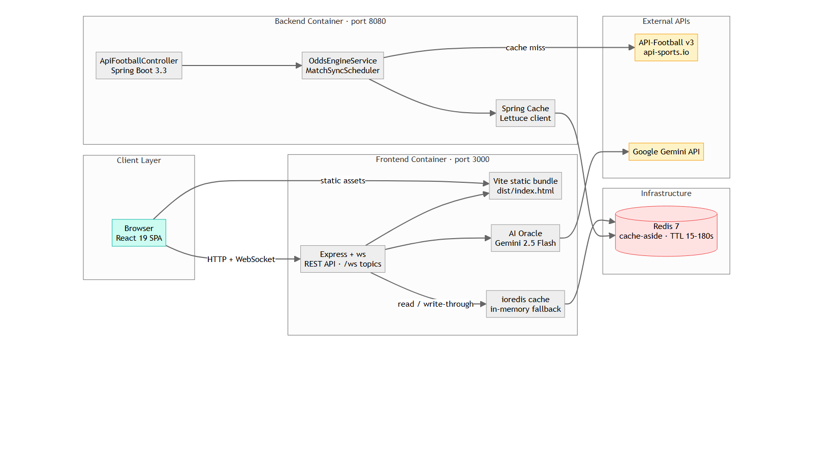

# Fida Bet

Sports betting and prediction market platform built for the Ethiopian market — React 19 frontend with a realtime Express API, plus a Spring Boot match & odds engine.



## Project Structure

```
fida-bet/
├── frontend/              # React 19 + TypeScript + Vite (SPA + realtime API server)
├── backend/               # Spring Boot 3.3 (Java 17) — match & odds engine
├── docker-compose.yml     # Full stack orchestration
├── Dockerfile             # Multi-stage build (frontend + realtime API)
├── .github/workflows/     # CI/CD pipelines
├── README.md
└── architecture.png       # System architecture diagram
```

## Tech Stack

### Frontend (`frontend/`)
- React 19 + TypeScript, Vite, Tailwind CSS 4
- Express + `ws` realtime API server (`server.ts`) — REST endpoints, STOMP-style WebSocket topics at `/ws`
- Redis caching (`ioredis`) with in-memory fallback
- Recharts, Lightweight Charts, Lucide React
- Gemini AI oracle integration (`@google/genai`)

### Backend (`backend/`)
- Spring Boot 3.3 (Java 17), Maven
- Spring Data Redis (Lettuce) cache-aside with granular TTLs
- API-Football v3 integration (`api-sports.io`) with distributed scheduler lock
- Spring Boot Actuator & validation

## Getting Started

### Full stack with Docker (recommended)

```bash
cp frontend/.env.example .env   # add your API keys (optional)
docker compose up -d
```

| Service | URL |
| :--- | :--- |
| Frontend + realtime API | http://localhost:3000 |
| Spring Boot backend | http://localhost:8080 |
| Redis | localhost:6379 |
| WebSocket topics | ws://localhost:3000/ws |

### Frontend development

```bash
cd frontend
npm install
npm run dev        # Vite dev server + API on port 3000
npm run build      # vite build + esbuild server bundle → dist/
npm run lint       # tsc --noEmit typecheck
```

### Backend local run

Requires Java 17+ and Maven 3.8+ (plus local Redis):

```bash
cd backend
export API_FOOTBALL_KEY="your_api_sports_key_here"
mvn spring-boot:run
```

## Environment Variables

| Variable | Used by | Purpose |
| :--- | :--- | :--- |
| `GEMINI_API_KEY` | frontend | AI Oracle responses (falls back to heuristic analysis) |
| `API_FOOTBALL_KEY` | frontend + backend | API-Football live/upcoming fixtures & odds |
| `API_FOOTBALL_PROVIDER` | frontend + backend | `api-sports` (default) or `rapidapi` |
| `ODDS_API_KEY` | frontend | Free match odds enrichment |
| `REDIS_URL` | frontend | External Redis (falls back to in-memory engine) |
| `REDIS_HOST` / `REDIS_PORT` | backend | Spring Redis connection |

Without Redis the frontend runs its in-memory Redis emulation; without API keys it serves bundled mock data — the full stack works out of the box for local development.

## Key Endpoints

### Frontend realtime API (port 3000)
| Method | Endpoint | Description |
| :--- | :--- | :--- |
| `GET` | `/api/matches?status=live\|upcoming` | Cached live/upcoming matches with odds |
| `GET` | `/api/matches/{id}/markets` | Market groups (1X2, Double Chance, Totals) |
| `POST` | `/api/bets/place` | Place single/multi bets (balance-checked) |
| `POST` | `/api/wallet/deposit` / `withdraw` | Wallet operations with transaction log |
| `POST` | `/api/auth/login` / `register` / `refresh` | Token-based auth (session restore on reload) |
| `POST` | `/api/age-verification/verify` | Fayda National ID age verification |
| `POST` | `/api/ai/oracle` | Gemini-powered market analysis |
| `WS` | `/ws` | Topic subscriptions for live odds/score updates |
| `GET` | `/api/health` | Health check |

### Spring Boot backend (port 8080)
| Method | Endpoint | Description |
| :--- | :--- | :--- |
| `GET` | `/api/football/fixtures/live?sport=all` | Cached live matches from API-Football |
| `GET` | `/api/football/fixtures/upcoming?sport=all` | Cached upcoming matches |
| `GET` | `/api/football/matches/{id}/markets` | Full market groups (1X2, Totals, Asian Handicap) |
| `POST` | `/api/football/sync` | Invalidate Redis caches, force refresh |
| `GET` | `/api/redis/stats` | Cache metrics (hit rate, keys, uptime) |
| `POST` | `/api/redis/flush?pattern=fidabet:*` | Invalidate key pattern |

## CI/CD

- **`.github/workflows/ci.yml`** — on push/PR: frontend typecheck + build, backend Maven package, Docker image builds for both services.
- **`.github/workflows/deploy.yml`** — on `main`: push images to GHCR and deploy to the production host via SSH (requires `DEPLOY_HOST`, `DEPLOY_USER`, `DEPLOY_SSH_KEY` secrets).

## Architecture

The system follows a cache-aside pattern: both services read/write through Redis with short TTLs (15–180s depending on data volatility), calling API-Football only on cache misses. A distributed lock (`SETNX`) ensures only one backend instance polls the upstream API when scaled horizontally. The frontend pushes live odds/score drift to browsers over WebSocket topic subscriptions, so UIs update without polling.

## License

Private — All rights reserved.
